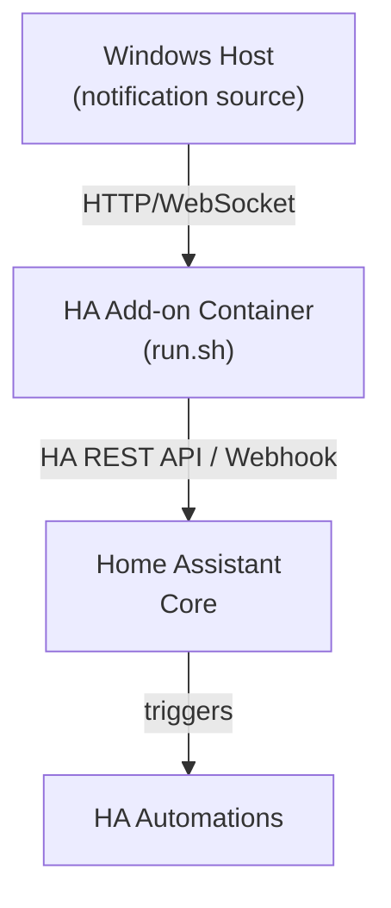
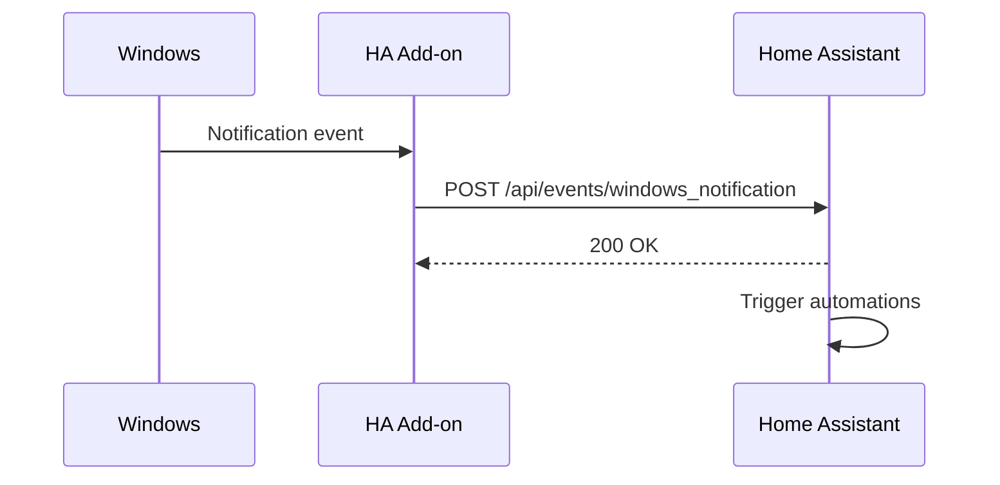
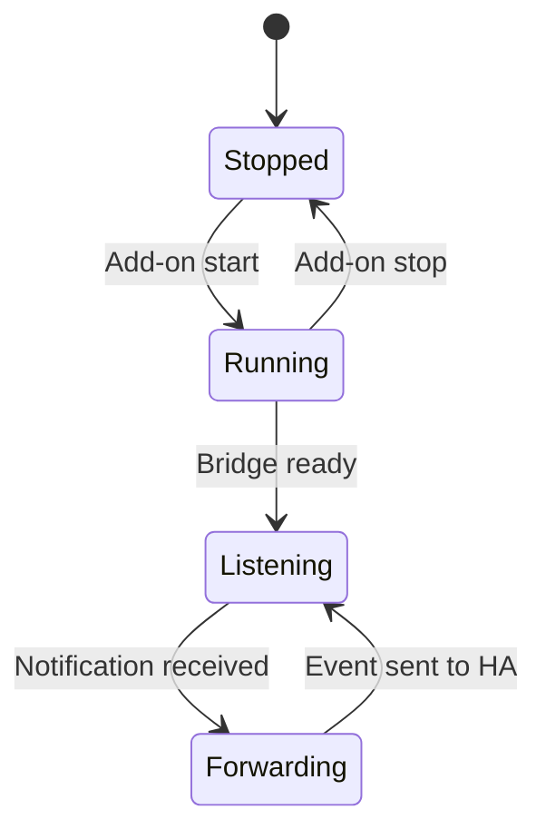

# ha-windows-notification-bridge — Overview

## What This Is
A Home Assistant add-on that bridges Windows system notifications to Home Assistant events. Runs as a Home Assistant supervisor add-on container.

## Who It's For
Home Assistant users who want Windows desktop notifications (alerts, reminders, system events) to appear as Home Assistant automatable events.

## Problem It Solves
Enables Windows notifications to trigger Home Assistant automations — e.g., a Windows alert could turn on a smart light or send a mobile notification.

## How It's Used
A Docker-based Home Assistant add-on defined with a config.yaml and Dockerfile. A shell script (run.sh) starts the notification bridge service that listens for Windows notifications and forwards them to Home Assistant via its REST API or webhook.

## Component Stack

## Data Flow

## Behavioral Model

---
*Generated by github-repo-overview skill · Last updated: 2026-06-09 · Stack: Shell + Docker + Home Assistant Add-on SDK*
